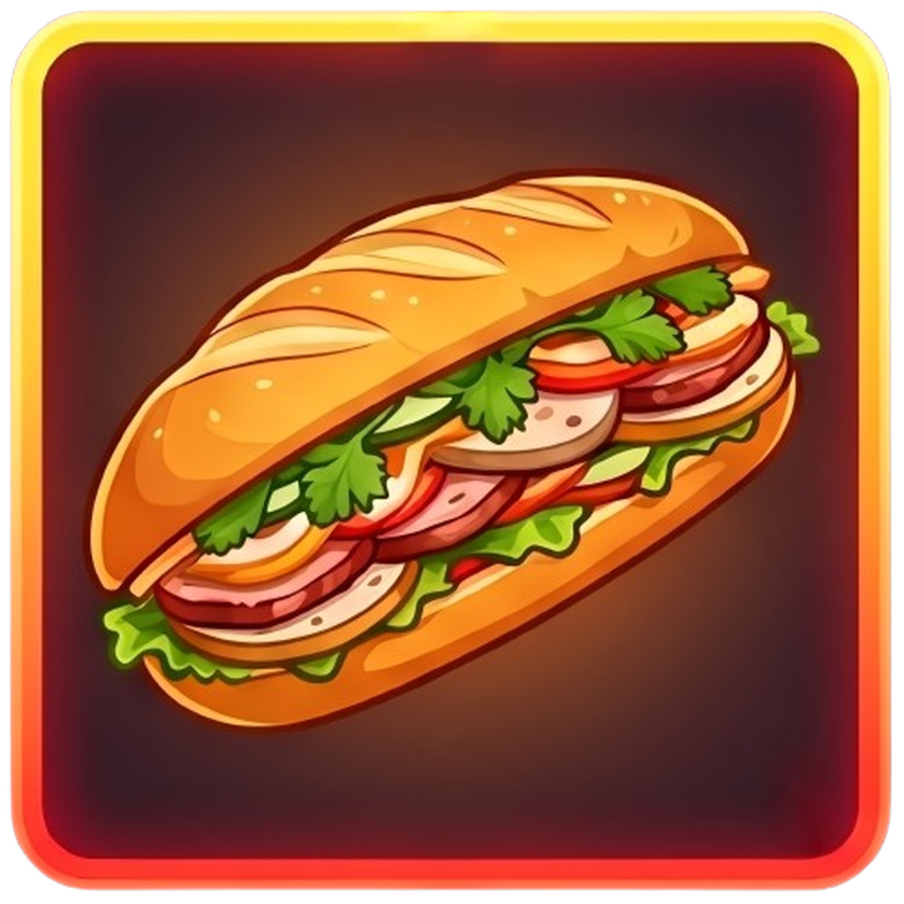

<p align="center">
  
</p>

<h1 align="center">Food Drop</h1>

<p align="center">Mở hòm, chốt món, vào bếp. Ứng dụng web và mobile giúp chọn thực đơn và nấu ăn hằng ngày thú vị hơn.</p>

---

## Tính năng chính

| Nhóm                  | Mô tả                                                                                          |
| --------------------- | ---------------------------------------------------------------------------------------------- |
| **Smart Recipe Hub**  | Lưu công thức, gắn tag đa chiều (ẩm thực, thiết bị, loại bữa, kỹ thuật, chế độ ăn)             |
| **Food Drop (gacha)** | Mở hòm kiểu CS:GO: dải món trượt ngang, chậm dần, tiếng tick. Độ hiếm theo thời gian và độ khó |
| **Hòm lười biếng**    | Quay ra quán ăn gần đó hoặc deep link đặt ship                                                 |
| **Context boost**     | Thời tiết (mưa, lạnh, nóng) tăng tỉ lệ rớt món phù hợp                                         |
| **AI Recipe Parser**  | Dán URL blog hoặc ảnh sách nấu ăn, nhận về công thức JSON chuẩn hóa (g/ml)                     |
| **Smart Utilities**   | Grocery list gộp theo quầy, Portion Resizer, Multi-Timer                                       |

## Cấu trúc repo

```
fooddrop/
├── fooddrop-web/        # Next.js 15 (App Router) + TypeScript + Tailwind
├── fooddrop-mobile/     # Flutter (Android/iOS), package com.trangnx.fooddrop
├── fooddrop-backend/    # NestJS + Drizzle + PostgreSQL + Redis/BullMQ
├── assets/brand/        # Logo gốc và các bản xuất
├── docs/                # Kiến trúc, chuẩn code, roadmap, changelog
├── plans/               # Kế hoạch triển khai theo phase
└── docker-compose.yml   # Postgres + Redis + S3 (SeaweedFS) cho môi trường dev
```

## Tech stack

| Tầng      | Công nghệ                                                                                       |
| --------- | ----------------------------------------------------------------------------------------------- |
| Web       | Next.js 15, React 19, TypeScript, Tailwind, TanStack Query, Zustand, Motion/GSAP, Web Audio API |
| Mobile    | Flutter 3.44, Riverpod, Drift (SQLite), flutter_soloud, flutter_local_notifications             |
| Backend   | NestJS, Drizzle ORM, PostgreSQL 17, Redis 7 + BullMQ, Zod                                       |
| AI        | Claude API (Haiku cho text, Sonnet cho ảnh), structured output qua tool use                     |
| Bên ngoài | Open-Meteo (thời tiết), Google Places (Hòm lười biếng), S3/R2 (ảnh)                             |

Chi tiết và lý do lựa chọn: [docs/system-architecture.md](docs/system-architecture.md).

## Bắt đầu nhanh

Yêu cầu: Node.js 22+, pnpm, Flutter 3.44+, Docker.

```bash
docker compose up -d
```

Sau đó làm theo README của từng app:

- [fooddrop-backend/README.md](fooddrop-backend/README.md)
- [fooddrop-web/README.md](fooddrop-web/README.md)
- [fooddrop-mobile/README.md](fooddrop-mobile/README.md)

> Các app chưa được scaffold. Bước scaffold nằm ở [Phase 01](plans/261006-1706-fooddrop-mvp/phase-01-setup-monorepo-and-scaffold.md).

## Tài liệu

- [Kiến trúc hệ thống](docs/system-architecture.md)
- [Database schema](docs/database-schema.md)
- [Chuẩn code](docs/code-standards.md)
- [Roadmap](docs/development-roadmap.md)
- [Changelog](docs/project-changelog.md)
- [Kế hoạch MVP](plans/261006-1706-fooddrop-mvp/plan.md)
